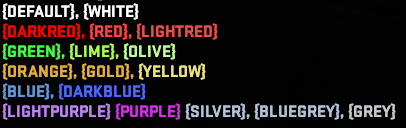

## Colored Messages

If you want to add Color to your chat message you need to use the color tags.

Here are all color tags:

### Colorlist



### Note

If you want to add color to the Center Message check this out: [Color For CenterMessage](./CenterMessageWithColor.md)

```json
[
    {
        "Title": "Rainbow",
        "Description": "rainbow command",
        "Command": "rainbow",
        "Message": "{RED}R{ORANGE}A{YELLOW}I{GREEN}N{BLUE}B{DARKBLUE}O{PURPLE}W",
        "PrintTo": 0
    },
    {
        "Title": "All Colors",
        "Description": "This command displays all the colors that are available to use in the chat.",
        "Command": "colors",
        "Message": "{DEFAULT}1, {WHITE}2 \n{DARKRED}3, {RED}4, {LIGHTRED}5\n{GREEN}6, {LIME}7, {OLIVE}8\n{ORANGE}9, {GOLD}10, {YELLOW}11\n{BLUE}12, {DARKBLUE}13\n{LIGHTPURPLE}14 {PURPLE}15 \n,{GREY}18",
        "PrintTo": 0
    }
]
```
